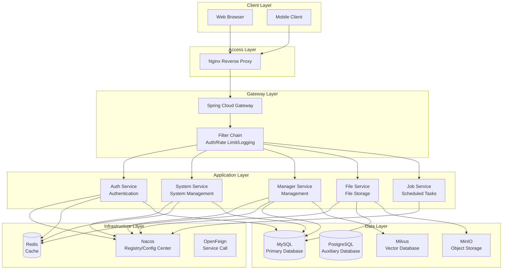
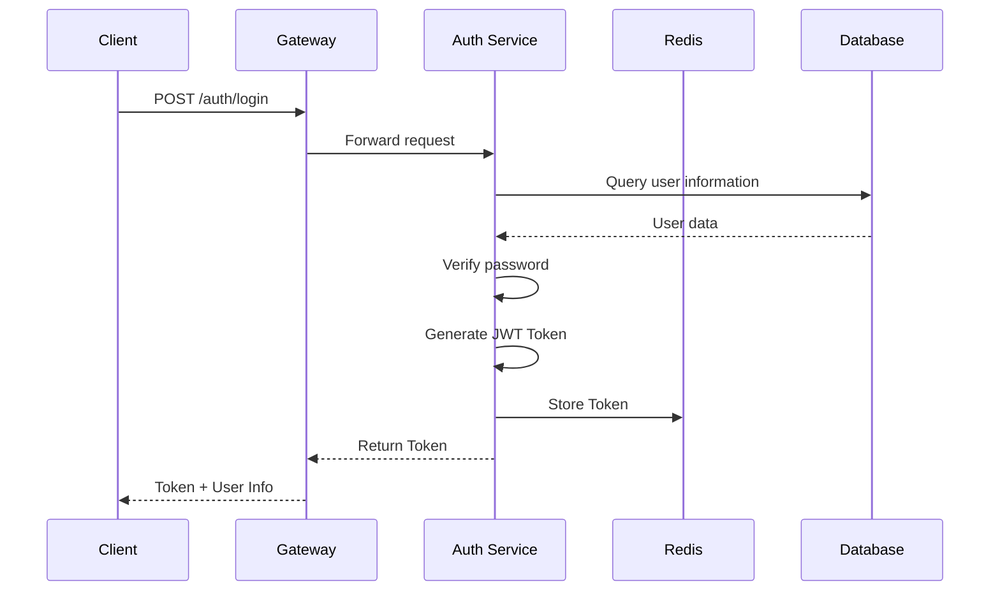
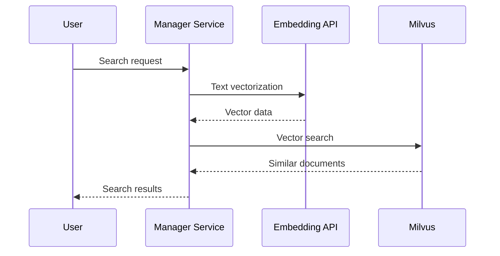
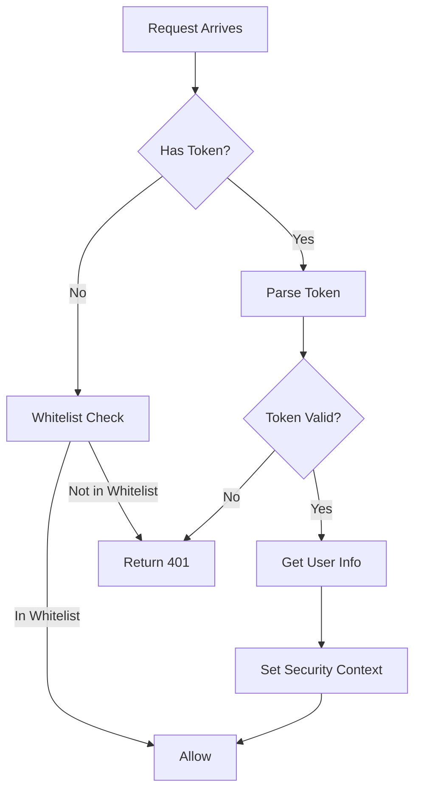

# System Architecture

## Overview
This document describes the overall architecture, design decisions, and technical patterns of the AISE microservice system. It provides a comprehensive understanding of system structure and design principles.

## Architecture Overview

### High-Level Architecture Diagram


## Architecture Principles

### 1. Microservices Architecture
- Each service has single responsibility
- Services communicate via APIs
- Independent deployment and scaling
- Flexible technology stack selection

### 2. Layered Architecture
- **Access Layer**: Nginx reverse proxy, SSL termination
- **Gateway Layer**: Unified entry, routing, authentication, rate limiting
- **Application Layer**: Business logic processing
- **Data Layer**: Data persistence

### 3. Service Governance
- **Service Registration**: Nacos service discovery
- **Configuration Center**: Nacos configuration management
- **Load Balancing**: Spring Cloud LoadBalancer
- **Service Call**: OpenFeign declarative client

### 4. Security Design
- **Authentication**: JWT Token
- **Authorization**: RBAC + Data Permissions
- **Transmission**: HTTPS encryption
- **Storage**: Encrypted password storage

## Core Components Details

### API Gateway

**Technology**: Spring Cloud Gateway

**Responsibilities**:
- Request routing and forwarding
- Identity authentication and authorization
- Request rate limiting and circuit breaking
- Request logging
- XSS attack protection

**Route Configuration**:
```yaml
spring:
  cloud:
    gateway:
      routes:
        - id: aise-auth
          uri: lb://aise-auth
          predicates:
            - Path=/auth/**
        - id: aise-system
          uri: lb://aise-system
          predicates:
            - Path=/system/**
        - id: aise-manager
          uri: lb://aise-manager
          predicates:
            - Path=/manager/**
```

**Filter Chain**:
```java
@Component
public class AuthFilter implements GlobalFilter {
    @Override
    public Mono<Void> filter(ServerWebExchange exchange, GatewayFilterChain chain) {
        // 1. Get Token
        // 2. Verify Token validity
        // 3. Parse user information
        // 4. Pass user information to downstream services
        return chain.filter(exchange);
    }
}
```

### Auth Service

**Technology**: Spring Security + JWT

**Responsibilities**:
- User login authentication
- JWT Token generation and verification
- Token refresh mechanism
- Login log recording

**Authentication Flow**:


### System Service

**Technology**: Spring Boot + MyBatis

**Responsibilities**:
- User management
- Role management
- Menu management
- Department management
- Dictionary management
- Configuration management
- LDAP integration
- OAuth2 integration

**Data Permission Implementation**:
```java
@Aspect
@Component
public class DataScopeAspect {
    
    @Before("@annotation(controllerDataScope)")
    public void doBefore(JoinPoint point, DataScope controllerDataScope) {
        // 1. Get current user
        // 2. Get user roles
        // 3. Build data permission SQL
        // 4. Inject into query parameters
    }
}
```

### Manager Service

**Technology**: Spring Boot + Milvus SDK

**Responsibilities**:
- AI model configuration management
- Prompt template management
- Knowledge base management
- Vector storage and retrieval
- Application marketplace management
- Dashboard data

**Vector Retrieval Flow**:


### File Service

**Technology**: Spring Boot + MinIO SDK

**Responsibilities**:
- File upload/download
- MinIO object storage
- FastDFS integration
- File preview

### Job Service

**Technology**: Quartz

**Responsibilities**:
- Scheduled task scheduling
- Task log management
- Task execution monitoring

## Inter-Service Communication

### Synchronous Call (OpenFeign)

```java
// Feign client definition
@FeignClient(value = "aise-system", fallbackFactory = RemoteUserFallbackFactory.class)
public interface RemoteUserService {
    @GetMapping("/user/info/{username}")
    R<LoginUser> getUserInfo(@PathVariable("username") String username);
}

// Service degradation handling
@Component
public class RemoteUserFallbackFactory implements FallbackFactory<RemoteUserService> {
    @Override
    public RemoteUserService create(Throwable cause) {
        return new RemoteUserService() {
            @Override
            public R<LoginUser> getUserInfo(String username) {
                return R.fail("Failed to get user: " + cause.getMessage());
            }
        };
    }
}
```

### Internal Service Authentication

```java
// Internal service call authentication annotation
@InnerAuth
@GetMapping("/user/info/{username}")
public R<LoginUser> getUserInfo(@PathVariable("username") String username) {
    return R.ok(userService.getUserInfo(username));
}

// Feign request interceptor
public class FeignRequestInterceptor implements RequestInterceptor {
    @Override
    public void apply(RequestTemplate template) {
        // Add internal service identifier
        template.header("from-source", "inner");
    }
}
```

## Security Architecture

### Authentication Flow


### Permission Control

**RBAC Model**:
```
User(User) ──┬── Role(Role) ──┬── Menu(Menu)
             │                │
             └── Data Permissions ──┘
```

**Permission Annotations**:
```java
// Single permission
@RequiresPermissions("system:user:list")

// Multiple permissions OR
@RequiresPermissions(value = {"system:user:add", "system:user:edit"}, logical = Logical.OR)

// Role validation
@RequiresRoles("admin")
```

### Data Permissions

```sql
-- Data permission filter example
SELECT * FROM sys_user u
LEFT JOIN sys_dept d ON u.dept_id = d.dept_id
WHERE 
-- All data
1=1
-- Department data
u.dept_id = #{deptId}
-- Department and below
FIND_IN_SET(#{deptId}, d.ancestors)
-- Own data only
u.user_id = #{userId}
```

## Caching Architecture

### Redis Caching Strategy

```java
// Cache configuration
@Configuration
public class RedisConfig {
    
    @Bean
    public RedisTemplate<String, Object> redisTemplate(RedisConnectionFactory factory) {
        RedisTemplate<String, Object> template = new RedisTemplate<>();
        template.setConnectionFactory(factory);
        template.setKeySerializer(new StringRedisSerializer());
        template.setValueSerializer(new GenericJackson2JsonRedisSerializer());
        return template;
    }
}

// Cache usage example
@Cacheable(value = "user", key = "#userId")
public SysUser selectUserById(Long userId) {
    return userMapper.selectUserById(userId);
}

@CacheEvict(value = "user", key = "#user.userId")
public int updateUser(SysUser user) {
    return userMapper.updateUser(user);
}
```

### Cache Key Specifications

| Key Prefix | Description | Example |
|------------|-------------|---------|
| `login_tokens:` | Login Token | `login_tokens:admin` |
| `sys_user:` | User Information | `sys_user:1` |
| `sys_config:` | System Configuration | `sys_config:sys.index.skinName` |
| `sys_dict:` | Dictionary Data | `sys_dict:sys_normal_disable` |

## Monitoring & Operations

### Health Check

```yaml
# Actuator configuration
management:
  endpoints:
    web:
      exposure:
        include: health,info,metrics
  endpoint:
    health:
      show-details: always
```

### Logging Standards

```java
// Use Slf4j
@Slf4j
@Service
public class UserServiceImpl {
    
    public void process() {
        log.info("Start processing user request");
        log.debug("User info: {}", user);
        log.error("Processing failed", exception);
    }
}
```

## Extensibility Design

### Plugin Architecture
- Strategy pattern for business extensions
- SPI mechanism for loading extension implementations
- Configuration-driven feature toggles

### Multi-Tenancy Support
- Tenant isolation (data/application)
- Tenant context propagation
- Tenant quota management

---

*This document should be updated when architecture changes. Use the `/context-update` command to keep it up to date.*
