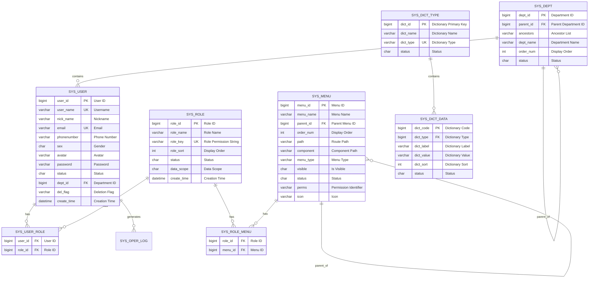

# Data Models

## Overview
This document describes the data models, relationships, and data flow of the AISE microservice system. It provides the information needed for AI models to understand the data structure.

## Core Entity Relationship Diagram



## Core Entity Definitions

### User Entity (SysUser)

**Purpose**: System user information, including authentication and basic information.

```java
public class SysUser {
    /** User ID */
    private Long userId;
    
    /** Username */
    private String userName;
    
    /** Nickname */
    private String nickName;
    
    /** Email */
    private String email;
    
    /** Phone Number */
    private String phonenumber;
    
    /** Gender (0: Male, 1: Female, 2: Unknown) */
    private String sex;
    
    /** Avatar URL */
    private String avatar;
    
    /** Password */
    private String password;
    
    /** Status (0: Normal, 1: Disabled) */
    private String status;
    
    /** Department ID */
    private Long deptId;
    
    /** Deletion Flag (0: Exists, 1: Deleted) */
    private String delFlag;
    
    /** Creation Time */
    private Date createTime;
    
    /** Role List */
    private List<SysRole> roles;
    
    /** Department Information */
    private SysDept dept;
}
```

### Role Entity (SysRole)

**Purpose**: Role information for permission control.

```java
public class SysRole {
    /** Role ID */
    private Long roleId;
    
    /** Role Name */
    private String roleName;
    
    /** Role Permission String */
    private String roleKey;
    
    /** Display Order */
    private Integer roleSort;
    
    /** Status (0: Normal, 1: Disabled) */
    private String status;
    
    /** Data Scope (1: All, 2: Custom, 3: Dept, 4: Dept and Below) */
    private String dataScope;
    
    /** Menu Group */
    private Long[] menuIds;
    
    /** Department Group (Data Permissions) */
    private Long[] deptIds;
}
```

### Menu Entity (SysMenu)

**Purpose**: Menu and permission definitions.

```java
public class SysMenu {
    /** Menu ID */
    private Long menuId;
    
    /** Menu Name */
    private String menuName;
    
    /** Parent Menu ID */
    private Long parentId;
    
    /** Display Order */
    private Integer orderNum;
    
    /** Route Path */
    private String path;
    
    /** Component Path */
    private String component;
    
    /** Menu Type (M: Directory, C: Menu, F: Button) */
    private String menuType;
    
    /** Is Visible (0: Show, 1: Hide) */
    private String visible;
    
    /** Status (0: Normal, 1: Disabled) */
    private String status;
    
    /** Permission Identifier */
    private String perms;
    
    /** Menu Icon */
    private String icon;
    
    /** Sub-menus */
    private List<SysMenu> children;
}
```

### Department Entity (SysDept)

**Purpose**: Organization structure department information.

```java
public class SysDept {
    /** Department ID */
    private Long deptId;
    
    /** Parent Department ID */
    private Long parentId;
    
    /** Ancestor List */
    private String ancestors;
    
    /** Department Name */
    private String deptName;
    
    /** Display Order */
    private Integer orderNum;
    
    /** Leader */
    private String leader;
    
    /** Contact Phone */
    private String phone;
    
    /** Status (0: Normal, 1: Disabled) */
    private String status;
    
    /** Sub-departments */
    private List<SysDept> children;
}
```

## AI Business Entities

### Model Configuration (ModelConfig)

**Purpose**: AI model configuration management.

```java
public class ModelConfig {
    /** Model ID */
    private Long modelId;
    
    /** Model Name */
    private String modelName;
    
    /** Model Type */
    private String modelType;
    
    /** API Key */
    private String apiKey;
    
    /** API URL */
    private String apiUrl;
    
    /** Max Tokens */
    private Integer maxTokens;
    
    /** Temperature Parameter */
    private Double temperature;
    
    /** Status */
    private String status;
}
```

### Knowledge Base (KnowledgeBase)

**Purpose**: Knowledge base management.

```java
public class KnowledgeBase {
    /** Knowledge Base ID */
    private Long kbId;
    
    /** Knowledge Base Name */
    private String kbName;
    
    /** Knowledge Base Type */
    private String kbType;
    
    /** Description */
    private String description;
    
    /** Vector Collection Name */
    private String collectionName;
    
    /** Embedding Model */
    private String embeddingModel;
    
    /** Document Count */
    private Integer docCount;
    
    /** Status */
    private String status;
}
```

### Prompt Template (PromptTemplate)

**Purpose**: Prompt management.

```java
public class PromptTemplate {
    /** Prompt ID */
    private Long promptId;
    
    /** Prompt Name */
    private String promptName;
    
    /** Prompt Content */
    private String content;
    
    /** Prompt Type */
    private String promptType;
    
    /** Input Variables */
    private String inputVariables;
    
    /** Creator */
    private Long createBy;
}
```

## Data Relationship Description

### One-to-Many Relationships
| Primary Table | Child Table | Relationship Description |
|---------------|-------------|--------------------------|
| SYS_DEPT | SYS_USER | One department contains multiple users |
| SYS_ROLE | SYS_USER_ROLE | One role associates multiple users |
| SYS_MENU | SYS_MENU | Menu self-reference (parent-child) |
| SYS_DICT_TYPE | SYS_DICT_DATA | One dictionary type contains multiple dictionary items |

### Many-to-Many Relationships
| Table A | Junction Table | Table B | Relationship Description |
|---------|---------------|---------|--------------------------|
| SYS_USER | SYS_USER_ROLE | SYS_ROLE | Association between users and roles |
| SYS_ROLE | SYS_ROLE_MENU | SYS_MENU | Association between roles and menus |

## Data Permission Control

### Data Scope Types
```java
// Data scope enum
public enum DataScope {
    ALL(1, "All Data Permission"),
    CUSTOM(2, "Custom Data Permission"),
    DEPT(3, "Department Data Permission"),
    DEPT_AND_CHILD(4, "Department and Below Data Permission"),
    SELF(5, "Own Data Permission Only");
}
```

### Data Permission SQL Example
```sql
-- Data permission filter
SELECT u.* FROM sys_user u
LEFT JOIN sys_dept d ON u.dept_id = d.dept_id
WHERE ${params.dataScope}

-- dataScope variable examples:
-- All: 1=1
-- Department: u.dept_id = #{deptId}
-- Department and below: 
--   u.dept_id = #{deptId} 
--   OR d.ancestors LIKE CONCAT('%,', #{deptId}, ',%')
```

## Index Optimization

### Common Indexes
```sql
-- User table indexes
CREATE INDEX idx_user_name ON sys_user(user_name);
CREATE INDEX idx_user_dept ON sys_user(dept_id);
CREATE INDEX idx_user_status ON sys_user(status);

-- Operation log indexes
CREATE INDEX idx_oper_log_user ON sys_oper_log(user_id);
CREATE INDEX idx_oper_log_time ON sys_oper_log(oper_time);

-- Dictionary indexes
CREATE INDEX idx_dict_type ON sys_dict_data(dict_type);
```

## Data Validation Rules

### User Validation
```java
public class SysUserValidator {
    // Username: 2-20 characters, alphanumeric and underscores
    @Pattern(regexp = "^[a-zA-Z0-9_]{2,20}$")
    private String userName;
    
    // Email: Standard email format
    @Email
    @Size(max = 50)
    private String email;
    
    // Phone: 11-digit number
    @Pattern(regexp = "^1[3-9]\\d{9}$")
    private String phonenumber;
    
    // Password: 6-20 characters, letters and numbers
    @Pattern(regexp = "^(?=.*[A-Za-z])(?=.*\\d)[A-Za-z\\d]{6,20}$")
    private String password;
}
```

## Data Migration Scripts

### Add Field Example
```sql
-- Add user extension fields
ALTER TABLE sys_user ADD COLUMN login_ip VARCHAR(128) COMMENT 'Last Login IP';
ALTER TABLE sys_user ADD COLUMN login_date DATETIME COMMENT 'Last Login Time';

-- Add index
CREATE INDEX idx_user_login ON sys_user(login_ip);
```

---

*This document should be updated when data models change. Use the `/context-update` command to keep it up to date.*
