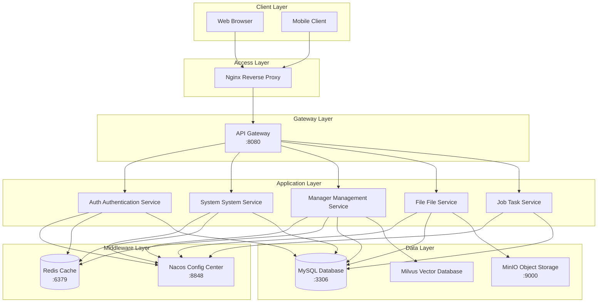

# Deployment Configuration

## Overview
This document describes the deployment architecture, configuration, and processes of the AISE microservice system. It provides detailed information needed for deployment environments.

## Deployment Architecture Diagram



## Environment Configuration

### Development Environment (dt)
```yaml
# Maven Profile: dt
environment: development
server:
  port: 8080

spring:
  datasource:
    url: jdbc:mysql://localhost:3306/aise-core
    username: root
    password: root

  redis:
    host: localhost
    port: 6379

  cloud:
    nacos:
      discovery:
        server-addr: localhost:8848
      config:
        server-addr: localhost:8848

minio:
  endpoint: http://localhost:9000
  accessKey: minioadmin
  secretKey: minioadmin
```

### Test Environment (sit)
```yaml
# Maven Profile: sit
environment: staging

spring:
  datasource:
    url: jdbc:mysql://${MYSQL_HOST}:3306/aise-core
    username: ${MYSQL_USER}
    password: ${MYSQL_PASSWORD}

  redis:
    host: ${REDIS_HOST}
    port: 6379
    password: ${REDIS_PASSWORD}

  cloud:
    nacos:
      discovery:
        server-addr: ${NACOS_HOST}:8848
```

### Production Environment (uat)
```yaml
# Maven Profile: uat
environment: production

spring:
  datasource:
    url: jdbc:mysql://${MYSQL_HOST}:3306/aise-core?useSSL=true
    username: ${MYSQL_USER}
    password: ${MYSQL_PASSWORD}
    hikari:
      maximum-pool-size: 20
      minimum-idle: 5

  redis:
    host: ${REDIS_HOST}
    port: 6379
    password: ${REDIS_PASSWORD}
    ssl: true
```

## Kubernetes Deployment

### Deployment Files Location
```
deploy-kubernetes/deploys/
├── aise-env-config.yaml           # Environment variable configuration
├── aise-nacos-config.yaml         # Nacos configuration
├── aise-nginx-config.yaml         # Nginx configuration
├── aise-gateway-deployment.yaml   # Gateway deployment
├── aise-auth-deployment.yaml      # Auth service deployment
├── aise-modules-system-deployment.yaml  # System service deployment
├── aise-manager-deployment.yaml   # Manager service deployment
├── aise-modules-file-deployment.yaml    # File service deployment
├── aise-modules-job-deployment.yaml     # Job service deployment
├── aise-mysql-deployment.yaml     # MySQL deployment
├── aise-redis-deployment.yaml     # Redis deployment
├── aise-nacos-deployment.yaml     # Nacos deployment
└── aise-minio-deployment.yaml     # MinIO deployment
```

### Service Deployment Configuration Example
```yaml
# aise-gateway-deployment.yaml
apiVersion: apps/v1
kind: Deployment
metadata:
  name: aise-gateway
  namespace: aise
spec:
  replicas: 2
  selector:
    matchLabels:
      app: aise-gateway
  template:
    metadata:
      labels:
        app: aise-gateway
    spec:
      containers:
      - name: aise-gateway
        image: leanisssharedacr.azurecr.io/cnpc/aisesystemcore_aise-gateway:latest
        ports:
        - containerPort: 8080
        env:
        - name: NACOS_HOST
          valueFrom:
            configMapKeyRef:
              name: aise-env-config
              key: NACOS_HOST
        resources:
          requests:
            memory: "512Mi"
            cpu: "250m"
          limits:
            memory: "1Gi"
            cpu: "500m"
        livenessProbe:
          httpGet:
            path: /actuator/health
            port: 8080
          initialDelaySeconds: 60
          periodSeconds: 10
        readinessProbe:
          httpGet:
            path: /actuator/health
            port: 8080
          initialDelaySeconds: 30
          periodSeconds: 5
```

### ConfigMap Configuration
```yaml
# aise-env-config.yaml
apiVersion: v1
kind: ConfigMap
metadata:
  name: aise-env-config
  namespace: aise
data:
  MYSQL_HOST: "aise-mysql"
  MYSQL_PORT: "3306"
  REDIS_HOST: "aise-redis"
  REDIS_PORT: "6379"
  NACOS_HOST: "aise-nacos"
  NACOS_PORT: "8848"
  MINIO_ENDPOINT: "http://aise-minio:9000"
```

## Docker Compose Deployment

### Full Deployment Configuration
```yaml
# deploy/docker-compose-allinone.yml
version: '3.8'

services:
  mysql:
    image: mysql:8.0
    environment:
      MYSQL_ROOT_PASSWORD: root
      MYSQL_DATABASE: aise-core
    ports:
      - "3306:3306"
    volumes:
      - mysql_data:/var/lib/mysql
      - ./mysql/init:/docker-entrypoint-initdb.d

  redis:
    image: redis:7.4
    ports:
      - "6379:6379"
    volumes:
      - redis_data:/data

  nacos:
    image: nacos/nacos-server:v2.4.2
    environment:
      MODE: standalone
      SPRING_DATASOURCE_PLATFORM: mysql
    ports:
      - "8848:8848"
    depends_on:
      - mysql

  minio:
    image: minio/minio:RELEASE.2024-04-06
    command: server /data --console-address ":9001"
    environment:
      MINIO_ROOT_USER: minioadmin
      MINIO_ROOT_PASSWORD: minioadmin
    ports:
      - "9000:9000"
      - "9001:9001"
    volumes:
      - minio_data:/data

  gateway:
    build: ../aise-gateway
    ports:
      - "8080:8080"
    depends_on:
      - nacos
      - redis

volumes:
  mysql_data:
  redis_data:
  minio_data:
```

## CI/CD Pipeline

### Azure Pipelines Configuration
```yaml
# azure-pipelines.yml
trigger:
  branches:
    include:
      - main
      - develop

stages:
  - stage: Build
    jobs:
      - job: MavenBuild
        steps:
          - task: Maven@3
            inputs:
              mavenPomFile: 'pom.xml'
              goals: 'clean package -DskipTests'
              jdkVersionOption: '1.8'
          
          - task: Docker@2
            inputs:
              command: 'build'
              Dockerfile: '**/Dockerfile'
              tags: '$(Build.BuildId)'

  - stage: Deploy
    jobs:
      - job: DeployToK8s
        steps:
          - task: Kubernetes@1
            inputs:
              command: 'apply'
              arguments: '-f deploy-kubernetes/deploys/'
```

## Environment Variables

### Core Environment Variables
| Variable Name | Description | Default Value |
|---------------|-------------|---------------|
| `MYSQL_HOST` | MySQL host address | localhost |
| `MYSQL_PORT` | MySQL port | 3306 |
| `REDIS_HOST` | Redis host address | localhost |
| `REDIS_PORT` | Redis port | 6379 |
| `NACOS_HOST` | Nacos host address | localhost |
| `NACOS_PORT` | Nacos port | 8848 |
| `MINIO_ENDPOINT` | MinIO address | http://localhost:9000 |
| `AISE_ACTIVATION_CODE` | Activation code | - |

## Service Port Mapping

### Internal Service Ports
| Service | Port | Description |
|---------|------|-------------|
| aise-gateway | 8080 | API Gateway |
| aise-auth | 9200 | Auth Service |
| aise-system | 9201 | System Service |
| aise-manager | 9202 | Manager Service |
| aise-file | 9300 | File Service |
| aise-job | 9203 | Job Service |
| nacos | 8848 | Config Center |
| mysql | 3306 | Database |
| redis | 6379 | Cache |
| minio | 9000/9001 | Object Storage |

## Deployment Checklist

### Before Deployment
- [ ] Database initialization scripts executed
- [ ] Nacos configuration imported
- [ ] Images pushed to repository
- [ ] Environment variables configured
- [ ] Storage volumes created

### During Deployment
- [ ] Service startup order correct
- [ ] Health checks passed
- [ ] Logs show no errors
- [ ] Service registration successful

### After Deployment
- [ ] API tests passed
- [ ] Monitoring alerts normal
- [ ] Backup strategy configured

## Troubleshooting

### Common Issues

#### Service Cannot Connect to Nacos
```bash
# Check Nacos status
kubectl get pods -n aise | grep nacos
kubectl logs -n aise aise-nacos-0

# Check network connectivity
kubectl exec -it <pod> -- ping aise-nacos
```

#### Database Connection Failed
```bash
# Check MySQL status
kubectl get pods -n aise | grep mysql
kubectl exec -it aise-mysql-0 -- mysql -uroot -p -e "SHOW DATABASES;"
```

#### Redis Connection Timeout
```bash
# Check Redis status
kubectl exec -it aise-redis-0 -- redis-cli ping
```

---

*This document should be updated when deployment configuration changes. Use the `/context-update` command to keep it up to date.*
