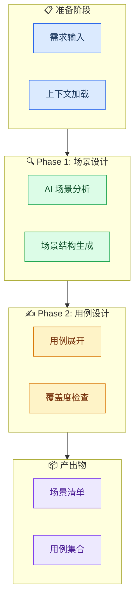
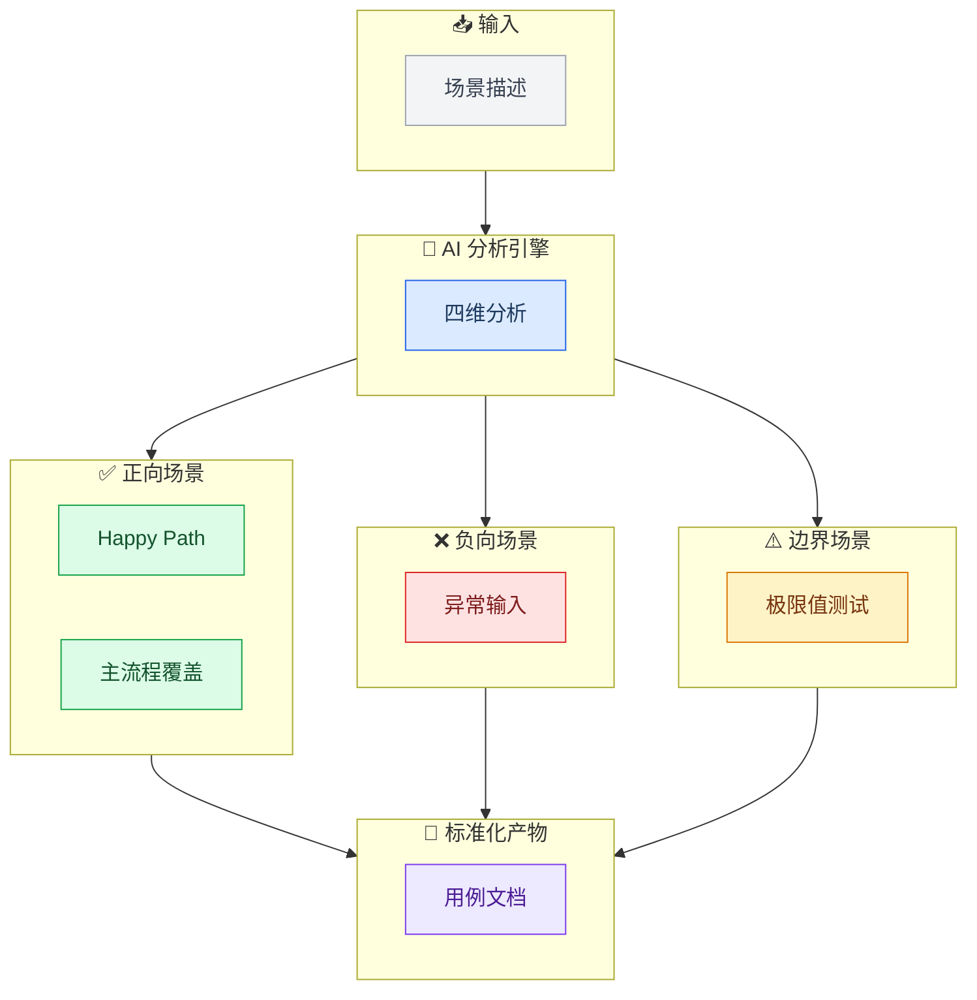

# ASDM Mermaid 配色规范 (Style Guide)

## Metadata

```json
{
  "guid": "a1b2c3d4-e5f6-7890-abcd-ef1234567890",
  "name": "mermaid-style-spec",
  "displayName": "Mermaid Style Specification",
  "description": "ASDM Showcase 文档中 Mermaid 图表的标准化配色与样式规范，确保所有 toolset 展示文档视觉一致性",
  "version": "1.0.0",
  "category": "visual-design"
}
```

## 概述

本规范定义了 ASDM Toolset Showcase 文档中所有 Mermaid 流程图必须遵循的 **浅色 Pastel 配色方案**，参考实现：`system-design-showcase.md`。

### 设计原则

| 原则 | 说明 |
|------|------|
| **浅底深字** | 填充色使用 pastel 浅色调（透明感），文字使用深色系 |
| **高对比度** | fill 与 color 之间必须有足够对比度（WCAG AA 级别） |
| **语义化** | 不同阶段/类型使用不同色系，一眼可辨 |
| **一致性** | 同一角色在多张图中保持相同颜色 |

---

## 标准调色板 (Color Palette)

### 基础色板 — 6 色语义化分类

| 角色语义 | 样式名 | Fill (填充) | Stroke (边框) | Color (文字) | 典型用途 |
|---------|--------|------------|--------------|-------------|---------|
| **输入 / 准备** | inputStyle / prepareStyle | `#f3f4f6` 或 `#dbeafe` | `#9ca3af` 或 `#2563eb` | `#374151` 或 `#1e3a5f` | 输入数据、准备阶段、前置条件 |
| **处理 / 分析 / AI引擎** | engineStyle / analysisStyle | `#dbeafe` | `#2563eb` | `#1e3a5f` | 核心处理逻辑、AI 分析模块 |
| **正向 / 成功 / Phase A** | positiveStyle / scenarioStyle | `#dcfce7` | `#16a34a` | `#14532d` | 正向场景、成功路径、第一阶段 |
| **负向 / 错误 / 风险** | negativeStyle / errorStyle | `#fee2e2` | `#dc2626` | `#7f1d1d` | 异常场景、错误路径、风险点 |
| **边界 / 条件 / 判断** | boundaryStyle / conditionStyle | `#fef3c7` | `#d97706` | `#78350f` | 边界值、条件分支、第二阶段 |
| **产出 / 输出 / 结果** | outputStyle / resultStyle | `#ede9fe` | `#7c3aed` | `#4c1d95` | 最终产物、输出文件、结果 |

### 扩展色板 — 可选补充

| 角色语义 | Fill | Stroke | Color | 说明 |
|---------|------|--------|-------|------|
| 外部系统 / 第三方 | `#fce7f3` | `#db2777` | `#831843` | 外部依赖 |
| 数据库 / 存储 | `#e0e7ff` | `#4f46e5` | `#312e81` | 持久化层 |
| 用户 / 交互 | `#ccfbf1` | `#0d9488` | `#134e4a` | 人机交互节点 |
| 配置 / 元数据 | `#f5f3ff` | `#8b5cf6` | `#4c1d95` | 配置项、参数 |

---

## classDef 声明模板

### 完整模板（复制即用）

```mermaid
%%{init: {'theme': 'base', 'themeVariables': { 'fontSize': '14px', 'fontFamily': 'system-ui' }}}%%

classDef prepareStyle fill:#dbeafe,stroke:#2563eb,color:#1e3a5f
classDef processStyle fill:#dbeafe,stroke:#2563eb,color:#1e3a5f
classDef phaseAStyle fill:#dcfce7,stroke:#16a34a,color:#14532d
classDef phaseBStyle fill:#fef3c7,stroke:#d97706,color:#78350f
classDef errorStyle fill:#fee2e2,stroke:#dc2626,color:#7f1d1d
classDef outputStyle fill:#ede9fe,stroke:#7c3aed,color:#4c1d95
classDef externalStyle fill:#fce7f3,stroke:#db2777,color:#831843
```

---

## 使用示例

### 示例 1：阶段流转图（flowchart + subgraph）



### 示例 2：三维分析模型（正向/负向/边界）



---

## 语法规则速查

| 规则 | ✅ 正确写法 | ❌ 错误写法 |
|------|------------|------------|
| **subgraph 样式** | `classDef s1 fill:#xxx; class SubgraphName s1` | `style SubgraphName fill:#xxx` |
| **实线标签** | `A --\|"label"\| B` | `A --"label"--> B` |
| **虚线标签** | `A -. label .-> B` | `A -.>\|"label"\| B` |
| **HTML 转义** | `&lt;`, `&gt;`, `&#124;` | `<`, `>`, `\|` |
| **class 关键字** | `class NodeId styleName` | `Class NodeId styleName`（大小写敏感） |
| **方向声明** | 仅在外层 flowchart 声明 | 子图内冗余 direction TB |

---

## 版本历史

| 版本 | 日期 | 变更 |
|------|------|------|
| v1.0.0 | 2026-05-08 | 初始版本，从 system-design-showcase.md 提取标准化配色方案 |
