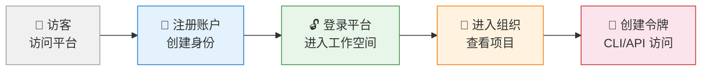

# Specifications for Docs Manual Update

## Purpose
本文档定义 `asdm-docs-manual-update` action 的专属规范，约束场景化操作手册的编写流程、文档结构、编写风格和输出规范。

## Shared Specifications
共享规范（关键文档引用、数据校验规则、路径约束、可靠性规则）详见 [specs4shared.md](./specs4shared.md)。

---

## 一、文档定位

### 1.1 与模块功能说明文档的区别

| 维度 | 场景化操作手册 | 模块功能说明文档 |
|------|--------------|-----------------|
| 目标 | 引导用户完成特定场景的端到端操作 | 描述功能模块的各项能力和操作方法 |
| 组织方式 | 按用户旅程顺序，步骤连贯 | 按功能区域分类，独立查阅 |
| 读者状态 | 从零开始的用户，需要被引导 | 有明确问题的用户，需要查阅特定功能 |
| 步骤衔接 | 步骤间严格衔接，前一步是后一步的前提 | 功能描述相对独立，可按需查阅 |
| 典型长度 | 聚焦单一场景，10-20 个步骤 | 覆盖整个模块，多个功能章节 |
| 路径 | `asdm-docs/public/docs/zh-cn/content/platform/manual/` | `asdm-docs/public/docs/zh-cn/content/platform/modules/` |

### 1.2 目标读者

场景化操作手册的读者是 ASDM 平台的**最终用户**，通常是：
- 首次使用平台的用户
- 需要完成特定操作流程的用户
- 按场景逐步学习平台使用的用户

### 1.3 文档目标

- 以用户旅程视角引导完成特定场景
- 每个步骤严格依赖系统可见界面，确保用户可实际完成操作
- 通过导航路径和截图降低操作迷路风险
- 说明场景完成后可达成什么效果（用户价值）

---

## 二、文档结构规范

### 2.1 标准章节结构

场景化操作手册必须遵循以下标准结构（编号体系）：

```
# {场景名称}

{一句话说明当前场景的目标和效果}

## 场景说明

{用户旅程描述，包含 Mermaid 流程图}

---

{目录表格}

---

## 1. {操作阶段A}
### 1.1 {步骤}
### 1.2 {步骤}
...

## 2. {操作阶段B}
### 2.1 {步骤}
### 2.2 {步骤}
...

## N. 下一步

{引导用户进入下一个场景}
```

### 2.2 各区域详细规范

#### 2.2.1 标题与一句话说明

标题下方紧跟一句话说明当前场景的目标和完成效果：

```markdown
# 用户注册和登录

引导您完成 ASDM 平台的账户创建和首次登录，获得可正常使用的平台账户并进入组织工作空间。
```

要求：
- 一句话，简洁明确
- 说明"做什么"和"完成后得到什么"
- 不超过 40 个汉字

#### 2.2.2 场景说明

场景说明放在标题之后、目录之前，包含以下要素：

1. **用户旅程描述**：站在当前用户角色的视角，描述整个场景的操作流程
2. **Mermaid 流程图**：用 `flowchart LR` 或 `flowchart TB` 展示用户旅程的主要阶段
3. **旅程概览**：编号列表，每个阶段一行简要说明
4. **完成价值说明**：用 ✅ 列表说明完成后可获得的具体成果
5. **前提提示**（如有）：使用 `>` 引用块说明前提条件

**Mermaid 图规范**：
- 使用 `flowchart LR`（从左到右）展示线性旅程
- 每个节点包含 emoji + 阶段名称 + 简要说明
- 使用 `style` 为不同阶段添加背景色
- 节点标签使用中文

**示例**：
```markdown
## 场景说明

作为新用户，您第一次接触 ASDM 平台时，需要完成从"访客"到"已认证用户"的转变。本场景以您的视角，描述这一完整的用户旅程：


```

#### 2.2.3 目录

目录使用表格形式，紧跟场景说明之后（使用 `---` 分隔），每个章节一行：

```markdown
| 章节 | 说明 |
|------|------|
| [1. 注册新账户](#1-注册新账户) | 通过邮箱创建 ASDM 账户，或使用第三方账号快速注册 |
| [2. 登录 ASDM 平台](#2-登录-asdm-平台) | 使用已注册的账户登录平台 |
| [5. 下一步](#5-下一步) | 继续探索下一个场景 |
```

要求：
- 必须包含所有主要章节的链接
- 每行提供简要说明
- 使用相对锚点链接

#### 2.2.4 操作步骤

每个操作阶段（一级章节）和步骤（二级章节）必须包含：

1. **引言段落**：说明本阶段/步骤的目标和上下文
2. **详细操作说明**：描述具体的界面操作，引用实际 UI 文本
3. **截图**：带导航路径和图例
4. **注意事项**（如需要）：使用 `>` 引用块

### 2.3 章节编号规则

- 一级章节使用 `1.` `2.` `3.` 编号（操作阶段）
- 二级章节使用 `1.1` `1.2` `2.1` 编号（具体步骤）
- 三级章节使用 `1.1.1` `1.1.2` 编号（步骤细分，仅在必要时使用）
- **禁止使用中文数字**
- 最后一个章节固定为"下一步"

### 2.4 必需章节

| 章节 | 必需 | 说明 |
|------|:----:|------|
| **一句话说明** | ✅ | 标题下方，说明场景目标和效果 |
| **场景说明** | ✅ | 用户旅程描述、Mermaid 图、完成价值 |
| **目录** | ✅ | 表格形式，包含所有章节链接和简要说明 |
| **操作步骤章节** | ✅ | 至少一个操作阶段，含详细步骤 |
| **下一步** | ✅ | 引导用户进入下一个场景 |

---

## 三、编写风格规范

### 3.1 用户旅程视角原则

**核心原则**：文档必须站在用户旅程视角撰写，以"您"为主语，描述操作流程。

| 禁止 | 推荐 |
|------|------|
| "用户需要在登录页面输入邮箱" | "在登录页面中，输入您的邮箱地址" |
| "系统提供了注册功能" | "您可以通过注册页面创建账户" |
| "该功能允许用户管理令牌" | "您可以在令牌管理页面查看和管理已创建的令牌" |

### 3.2 仅描述系统可见界面原则

**核心原则**：每个操作步骤必须严格依赖系统可见的操作界面，所有按钮文字、标签、提示信息必须通过代码扫描验证，不得凭空捏造。

| 要求 | 说明 |
|------|------|
| 按钮文字 | 必须从 i18n 文件或组件代码中提取实际文字 |
| 提示信息 | 必须与代码中的 toast/message 文字一致 |
| 页面标题 | 必须与路由配置或页面组件中的标题一致 |
| 选项列表 | 必须从代码中提取实际的选项值 |

### 3.3 操作步骤统一格式

每个操作步骤采用统一的描述格式：

```
### X.Y {步骤名称}

{步骤目标说明：这个步骤要完成什么}

{详细操作说明：在哪个界面、做什么操作、点击什么按钮}

{截图：导航路径 + 图片 + 图例}

{注意事项（如需要）：使用 > 引用块}
```

**步骤名称要求**：
- 简明扼要，动词开头
- 如"进入注册页面"、"填写令牌信息"、"提交创建"

**步骤间衔接要求**：
- 每个步骤必须从前一步骤的结果自然过渡
- 不得出现"进入某页面"但未说明如何从当前页面跳转的情况
- 如果步骤涉及页面跳转，必须说明跳转入口

### 3.4 截图规范

#### 3.4.1 截图三要素

每个截图位置必须包含三个要素：

1. **导航路径**（截图上方）：说明用户如何导航到截图所示页面
2. **截图图片**：实际截图或占位符
3. **图例说明**（截图下方）：格式为 `图 X-Y：说明文字`

```markdown
首页 ｜ 用户头像 ｜ 访问令牌


图 6-1：点击用户头像后的下拉菜单，选择"访问令牌"
```

#### 3.4.2 导航路径格式

- 使用 `｜` 分隔导航层级
- 每个层级对应实际界面上可点击或可见的元素
- 格式：`{层级1} ｜ {层级2} ｜ {层级3}`
- 示例：
  - `登录页面 ｜ 注册`
  - `首页 ｜ 用户头像 ｜ 访问令牌`
  - `访问令牌 ｜ 创建令牌`
  - `组织首页 ｜ 组织设置 ｜ 用户管理`

#### 3.4.3 图例编号格式

- 格式：`图 {章节号}-{序号}：说明文字`
- 章节号对应一级章节编号
- 序号在章节内递增
- 示例：`图 1-1`、`图 2-3`、`图 4-5`

#### 3.4.4 截图占位符

如无实际截图，使用占位符，格式与实际截图相同：

```markdown
登录页面 ｜ 邮箱密码表单


图 2-2：登录表单，输入邮箱和密码
```

后续补充截图时，只需将图片文件放入 `images/` 目录即可。

#### 3.4.5 截图文件命名

- 文件名格式：`{场景缩写}-{功能关键词}.png`
- 使用英文短横线连接
- 示例：`sign-in.png`、`register-form.png`、`pat-create-dialog.png`

### 3.5 文字说明充分性

每个步骤必须包含充分的文字说明，不可仅由标题和截图组成。

**错误示范**：
```markdown
### 2.2 输入登录凭证

登录页面 ｜ 邮箱密码表单


图 2-2：登录表单
```

**正确示范**：
```markdown
### 2.2 输入登录凭证

在表单中填写：

1. **邮箱** — 输入您注册时使用的邮箱地址
2. **密码** — 输入对应的登录密码

> 如果您忘记了密码，点击 **"忘记密码？"** 链接进行密码重置。

登录页面 ｜ 邮箱密码表单


图 2-2：登录表单，输入邮箱和密码
```

---

## 四、代码扫描规范

### 4.1 扫描范围

编写场景化手册前，必须扫描以下代码区域：

1. **前端页面组件**：
   - 路由定义文件（确定页面 URL 和跳转关系）
   - 页面组件（确定页面布局和功能）
   - 子组件（确定交互细节）
   - 类型定义（确定数据结构和状态值）

2. **国际化文件**：
   - 翻译键值（确定界面文字的准确措辞）
   - 表单标签、按钮文字、提示信息、错误信息

3. **API 服务层**：
   - API client 方法（确定功能列表）
   - 请求/响应类型（确定字段和枚举值）

4. **权限相关**：
   - 权限检查逻辑（确定访问控制规则）
   - 角色判断逻辑（确定角色可见性）

### 4.2 扫描结果应用

扫描结果必须转化为用户可理解的操作描述：

| 代码发现 | 手册描述 |
|----------|----------|
| `t('auth.login.title')` → "登录 ASDM" | 登录页面标题为 **"登录 ASDM"** |
| `t('auth.register.submit')` → "注册" | 点击 **"注册"** 按钮 |
| `t('auth.login.thirdParty.google')` → "Google 登录" | 点击 **"Google 登录"** 按钮 |
| `status === "Active"` | 项目状态为"Active" |
| `navigate('/register')` | 点击"注册"链接跳转至注册页面 |

### 4.3 歧义处理

如代码扫描中发现界面逻辑不清晰的部分：
- 必须向用户提出问题确认
- 不可凭推测编写文档
- 特别注意：条件显示的按钮、动态生成的选项、环境相关的功能

---

## 五、文档路径规范

### 5.1 文档目录结构

```
asdm-docs/public/docs/zh-cn/content/platform/manual/{scenario-name}/
├── _index.md              # 场景手册入口文档（必需）
└── images/                # 截图目录
    ├── sign-in.png
    ├── register-page.png
    └── ...
```

### 5.2 路径命名规则

- 目录名使用英文短横线连接：`user-registration-login`、`organization-project-setup`
- 每个场景使用独立子目录
- `_index.md` 为入口文档，Hugo 等静态站点生成器会自动将其作为目录首页
- 截图放在同级的 `images/` 目录中

### 5.3 与 get-started 索引页的关系

`platform/get-started/_index.md` 是快速启动类场景手册的索引页面，包含所有场景的说明和链接。新增场景手册时，应同步更新该索引页面，添加新场景的条目。

### 5.4 场景间导航

每个场景手册的"下一步"章节应链接到下一个逻辑场景：

```markdown
## N. 下一步

{当前场景}完成后，继续完成下一个场景：[{下一场景名称}](../{下一场景路径}/)
```

---

## 六、更新现有文档规范

### 6.1 更新流程

1. 读取现有 `_index.md`
2. 代码扫描获取最新界面实现
3. 对比现有文档与代码，识别：
   - 缺失的操作步骤
   - 过时的界面描述（代码已变更）
   - 需要补充截图的位置
4. 仅更新需要变更的部分，保留现有合理内容
5. 保持章节编号连续和图例编号正确

### 6.2 更新原则

- **不破坏现有结构**：保持章节编号和目录结构稳定
- **增量更新**：仅添加或修正内容，不重写整个文档
- **保持风格一致**：新增内容与现有内容风格保持一致
- **图例编号重排**：如增删截图，需重新编排图例编号

---

## 七、质量检查

### 7.1 完整性检查

文档生成后应自查以下项目：

| 检查项 | 要求 |
|--------|------|
| 一句话说明 | 标题下方有简洁的场景目标描述 |
| 场景说明 | 包含用户旅程描述、Mermaid 流程图、完成价值 |
| 目录 | 表格形式，包含所有章节的可点击链接 |
| 编号体系 | 使用 1. / 1.1 / 1.1.1 编号，无遗漏 |
| 步骤衔接 | 每个步骤可从前一步自然过渡 |
| 截图导航路径 | 每个截图上方有导航路径 |
| 截图图例 | 每个截图下方有图例说明 |
| 用户视角 | 使用"您"为主语，站在用户旅程视角 |
| 界面验证 | 所有按钮文字、标签、提示信息与代码一致 |
| 文字说明充分 | 每个步骤有详细操作说明，非仅标题+截图 |
| 下一步引导 | 末尾引导用户进入下一个场景 |
| 粗体格式 | 执行 specs4shared.md 9.4 节粗体格式检查（B1-B5） |

### 7.2 常见问题

| 问题 | 修正方式 |
|------|----------|
| 缺少场景说明 | 在标题和目录之间添加场景说明，含 Mermaid 图 |
| 步骤间断裂 | 补充跳转说明，确保用户可实际完成操作 |
| 缺少导航路径 | 在截图上方添加导航路径 |
| 缺少图例 | 在截图下方添加图例说明 |
| 凭空捏造界面文字 | 通过代码扫描验证，替换为实际界面文字 |
| 仅标题+截图无说明 | 补充详细的操作说明文字 |
| 编号不连续 | 重新编排编号，确保连续 |
| 粗体格式问题 | 执行 B1-B5 检查并修复 |
