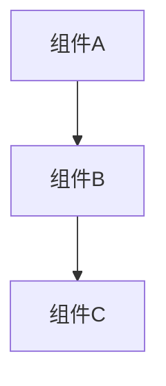
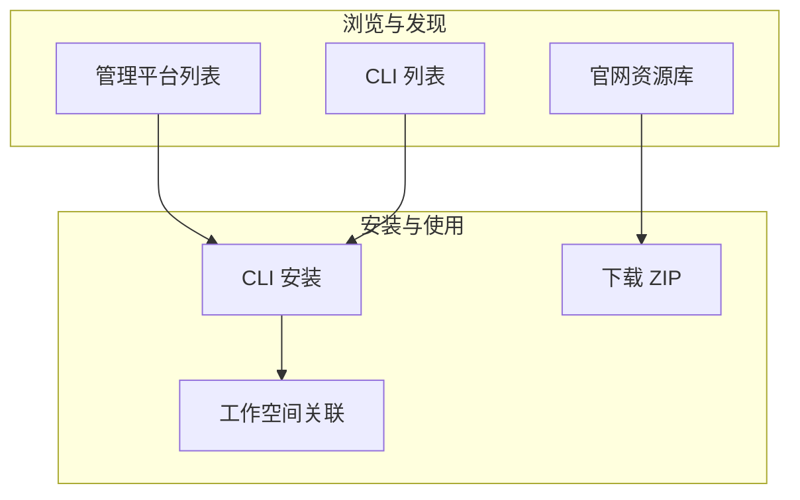

# Specifications for Docs Module Update

## Purpose
本文档定义 `asdm-docs-module-update` action 的专属规范，约束模块功能说明文档的编写流程、文档结构、编写风格和输出规范。

## Shared Specifications
共享规范（关键文档引用、数据校验规则、路径约束、可靠性规则）详见 [specs4shared.md](./specs4shared.md)。

---

## 一、文档定位

### 1.1 目标读者

模块功能说明文档的读者是 ASDM 平台的**最终用户**，包括：
- 平台管理员（超级管理员、组织管理员）
- 项目管理员
- 普通用户（开发人员、设计师、分析师等）

文档不应面向开发人员，避免出现代码片段、API 设计细节或架构实现描述。

### 1.2 文档目标

- 帮助用户理解功能模块的作用和价值
- 指导用户完成功能模块中的各项操作
- 作为平台操作手册供用户查阅

### 1.3 与特性文档的区别

| 维度 | 模块功能说明文档 | 特性文档（Feature Doc） |
|------|------------------|------------------------|
| 受众 | 最终用户 | 产品团队、开发团队 |
| 目标 | 操作指导、功能说明 | 技术方案、实现规划 |
| 内容 | 功能描述、操作步骤、截图 | 架构设计、接口设计、数据模型 |
| 语言 | 用户视角、通俗语言 | 技术语言、专业术语 |
| 路径 | `asdm-docs/public/docs/zh-cn/content/` | `docs/planning/Feat/` |

---

## 二、文档结构规范

### 2.1 标准章节结构

模块功能说明文档必须遵循以下标准结构（编号体系）：

```
# {模块名称}

{顶部概述段落}

## 目录

- [1. 概述](#1-概述)
  - [1.1 {子章节}](#11-{子章节})
  - ...
- [2. {功能章节A}](#2-{功能章节a})
  - [2.1 {子章节}](#21-{子章节})
  - ...
- [3. {功能章节B}](#3-{功能章节b})
  ...

---

## 1. 概述
### 1.1 ...
### 1.2 ...

## 2. {功能章节A}
### 2.1 ...
### 2.2 ...

## 3. {功能章节B}
### 3.1 ...
### 3.2 ...
```

### 2.2 章节编号规则

- 一级章节使用 `1.` `2.` `3.` 编号
- 二级章节使用 `1.1` `1.2` `2.1` 编号
- 三级章节使用 `1.1.1` `1.1.2` 编号
- 目录中使用相对锚点链接，与实际章节标题完全一致
- **禁止使用中文数字**（如"一、"、"二、"）

### 2.3 必需章节

| 章节 | 必需 | 说明 |
|------|:----:|------|
| **顶部概述段落** | ✅ | 文档开头一段话说明当前文档的作用和覆盖范围 |
| **目录** | ✅ | 提供可点击的目录导航 |
| **1. 概述** | ✅ | 详细说明模块功能、核心概念和总体架构 |
| **功能章节** | ✅ | 根据模块功能特性组织，覆盖所有功能点 |

### 2.4 可选章节

| 章节 | 说明 |
|------|------|
| **更多主题** | 列出关联模块文档的链接 |
| **常见问题** | 用户常见问题和解答 |
| **相关概念** | 解释模块涉及的专业术语 |

---

## 三、编写风格规范

### 3.1 用户视角原则

**核心原则**：文档必须站在用户的视角撰写，而非开发者视角。

| 禁止 | 推荐 |
|------|------|
| "系统通过 API 调用获取项目列表" | "您可以在项目列表页面浏览所有项目" |
| "前端发送 GET 请求到 /api/projects" | "页面加载时自动获取项目数据" |
| "数据库中 projects 表的 status 字段" | "项目状态（Active/Pending/Completed）" |
| "React 组件 ProjectList 渲染项目卡片" | "项目以卡片形式展示在列表中" |

### 3.2 仅描述用户可见功能原则

**核心原则**：文档应只包含用户在界面上能看到和操作的功能，避免暴露系统内部实现细节。

用户不需要了解系统是如何工作的，只需要知道系统能为他们做什么。技术实现细节会干扰用户理解，降低文档可读性。

| 禁止（技术细节） | 推荐（用户可见） |
|------|------|
| 权限标识符 `org:read`、`project:write` | "查看组织信息"、"编辑项目内容" |
| 数据库字段 `collectionId`、`projectId` | "所属组织"、"分配的项目" |
| 通配符 `*` 表示全局权限 | "拥有所有权限" |
| 错误代码 `ROLE_CONFLICT_SUPER_ADMIN_EXCLUSIVE` | "超级管理员不能再拥有其他角色" |
| 表名 `user_rule_mappings` | （删除，不需要提及） |
| API 路径 `/api/collections/{id}/users` | "在组织设置中管理成员" |
| 枚举值 `RoleType.SUPER_ADMIN` | "超级管理员" |
| 作用域参数 `(collectionId=*, projectId=*)` | "适用于所有组织和项目" |
| JWT token 中的 claims | （删除，用户不可见） |
| 后端注解 `@PreAuthorize("hasPermission(...)")` | （删除，纯实现细节） |

**判断标准**：如果用户在界面上看不到这个概念、标识符或值，就不应该出现在文档中。当需要用技术实现来验证功能描述的准确性时，应在代码扫描阶段完成，而非体现在最终文档中。

### 3.3 文字说明充分性

每个章节必须包含充分的文字说明，不可仅由标题和表格组成。

**错误示范**：
```markdown
### 1.2 核心功能

| 功能 | 描述 |
|------|------|
| 项目管理 | 创建和管理项目 |
| 团队协作 | 邀请成员 |
```

**正确示范**：
```markdown
### 1.2 核心功能

组织模块为团队协作提供了一整套管理能力。通过组织，您可以将相关的项目集中管理，
统一分配团队成员和权限，并共享全局资源。以下列出了组织的核心功能：

| 功能 | 描述 |
|------|------|
| 项目管理 | 在组织内创建和管理多个项目，每个项目拥有独立的工作空间 |
| 团队协作 | 邀请团队成员加入组织或项目，分配不同的角色和权限 |
| 资源共享 | 在项目之间共享工具集、规约等全局资源 |
```

### 3.4 图表规范

文档中的图表分为两类：**Mermaid 图**和**截图**，应根据内容类型选择合适的表达方式。

#### 3.4.1 Mermaid 图（架构、关系、结构类）

架构图、关系图、结构图、流程图、状态图等**非 UI 界面类**图表，必须使用 Mermaid 语法绘制，而非使用图片占位符。Mermaid 图在 Markdown 中可直接渲染，无需维护图片文件，且便于后续更新。

**适用场景**：

| 图表类型 | Mermaid 图类型 | 示例 |
|----------|---------------|------|
| 功能架构 | `graph` | 模块功能组成与层级关系 |
| 组件关系 | `graph` | 平台、CLI、仓库等组件间的交互关系 |
| 状态流转 | `stateDiagram-v2` | 项目状态、工作空间状态等 |
| 流程图 | `graph` / `flowchart` | 操作流程、数据流转 |
| 层级结构 | `graph` | 组织→项目→工作空间的层级 |
| 时序图 | `sequenceDiagram` | 组件间的调用时序 |

**格式规范**：

```markdown


*图：{图表说明文字}*
```

**Mermaid 图无需导航路径**（因为不对应具体 UI 页面），仅在图下方附图注说明即可。

**样式建议**：
- 使用 `graph TB`（从上到下）或 `graph LR`（从左到右）控制方向
- 使用 `subgraph` 对相关节点分组
- 使用 `style` 为不同分组添加背景色，增强可读性
- 节点标签使用中文，简洁明确

**完整示例**：
```markdown


*图：规约说明功能架构示意*
```

#### 3.4.2 截图（UI 界面类）

在以下位置应提供截图占位符：

- 概述章节：展示模块主要界面的截图
- 操作说明：展示具体操作步骤的界面截图
- 功能特性：展示功能效果的关键界面截图

**截图占位符格式**：
```markdown
用户可以通过 {导航路径} 访问{页面/功能}


*图：{截图说明文字}*
```

**导航路径格式**：
- 截图上方必须标注导航路径，说明用户如何通过界面导航到达截图所示页面
- 使用 `｜` 分隔导航层级，格式为：`用户可以通过 {层级1} ｜ {层级2} ｜ {层级3} 访问此页面`
- 示例：
  - `用户可以通过 项目首页 ｜ 资源库 ｜ 工具集 访问此页面`
  - `用户可以通过 项目首页 ｜ 项目设置 ｜ 用户 访问此页面`
  - `用户可以通过 组织首页 ｜ 组织设置 ｜ 用户管理 访问此页面`
- CLI 命令截图使用命令提示格式：`在终端中执行 \`asdm toolset list\` 命令查看`
- 导航路径放在图片上方，图注仅保留图名描述

**命名规范**：
- 文件名格式：`{模块缩写}-{功能关键词}.png`
- 示例：`org-project-list.png`、`inst-create-dialog.png`、`repo-registry-overview.png`

**完整示例**：
```markdown
用户可以通过 项目首页 ｜ 资源库 ｜ 工具集 访问此页面


*图：管理平台工具集列表页面*
```

**截图占位符下方必须附说明文字**，使用斜体标注，如：`*图：组织项目列表页面*`

### 3.5 表格使用规范

- 表格前应有文字说明，解释表格内容和用途
- 表格列名使用中文
- 状态值等使用用户可理解的语言（如"已完成"而非"✅"）
- 对比类表格应突出差异点

---

## 四、代码扫描规范

### 4.1 扫描范围

编写模块文档前，必须扫描以下代码区域：

1. **前端页面组件**：
   - 路由定义文件（确定页面 URL 结构）
   - 页面组件（确定页面布局和功能）
   - 子组件（确定交互细节）
   - 类型定义（确定数据结构和状态值）

2. **API 服务层**：
   - API client 方法（确定功能列表）
   - 请求/响应类型（确定字段和枚举值）

3. **权限相关**：
   - 权限检查逻辑（确定访问控制规则）
   - 角色判断逻辑（确定角色可见性）

4. **国际化文件**：
   - 翻译键值（确定界面文字的准确措辞）

### 4.2 扫描结果应用

扫描结果应转化为用户可理解的功能描述：

| 代码发现 | 文档描述 |
|----------|----------|
| `status === "Active"` | 项目状态为"Active"（进行中），以绿色标识 |
| `canAccessCollection(id)` | 只有被授权的用户才能访问对应组织 |
| `fetchProjectsByCollectionId()` | 页面自动加载当前组织下的项目列表 |
| `showCreateModal && createProject()` | 点击"新建项目"按钮创建新项目 |
| `selectedStatus` filter | 可按项目状态筛选显示 |

### 4.3 歧义处理

如代码扫描中发现功能逻辑不清晰的部分：
- 必须向用户提出问题确认
- 不可凭推测编写文档
- 特别注意：权限判断、状态流转、条件显示等逻辑

---

## 五、文档路径规范

### 5.1 文档目录结构

```
asdm-docs/public/docs/zh-cn/content/platform/modules/{module-name}/
├── _index.md              # 模块主文档（必需）
├── images/                # 截图目录
│   ├── {module}-overview.png
│   ├── {module}-detail.png
│   └── ...
├── {sub-module-1}.md      # 子模块文档（可选）
├── {sub-module-2}.md      # 子模块文档（可选）
└── ...
```

### 5.2 路径命名规则

- 目录名使用英文短横线连接：`organization`、`instance-management`、`repo-management`
- 文档文件名使用英文短横线连接：`projects.md`、`user-management.md`、`permissions.md`
- 截图文件名使用英文短横线连接：`org-project-list.png`
- `_index.md` 为模块入口文档，Hugo 等静态站点生成器会自动将其作为目录首页

### 5.3 子模块文档关联

`_index.md` 中必须包含指向子模块文档的目录链接：

```markdown
## 目录

- [1. 概述](#1-概述)
- [项目管理](./projects.md)
- [用户管理](./user-management.md)
- [权限系统](./permissions.md)
```

子模块文档末尾应包含返回链接：

```markdown
---

[← 返回组织结构管理](./_index.md)
```

---

## 六、更新现有文档规范

### 6.1 更新流程

1. 读取现有 `_index.md` 和子模块文档
2. 代码扫描获取最新功能实现
3. 对比现有文档与代码，识别：
   - 缺失的功能描述
   - 过时的功能描述（代码已变更）
   - 需要补充截图的位置
4. 仅更新需要变更的部分，保留现有合理内容
5. 在文档顶部更新"最后更新"日期

### 6.2 更新原则

- **不破坏现有结构**：保持章节编号和目录结构稳定
- **增量更新**：仅添加或修正内容，不重写整个文档
- **保持风格一致**：新增内容与现有内容风格保持一致
- **截图补充**：为已有文字描述补充截图占位符

---

## 七、质量检查

### 7.1 完整性检查

文档生成后应自查以下项目：

| 检查项 | 要求 |
|--------|------|
| 概述段落 | 文档开头有一段话说明文档作用 |
| 目录 | 包含所有章节的可点击链接 |
| 编号体系 | 使用 1. / 1.1 / 1.1.1 编号，无遗漏 |
| 文字说明 | 每个章节有充分的文字说明，非仅标题+表格 |
| 截图占位符 | 关键界面和操作步骤有截图占位符 |
| 用户视角 | 文字描述面向用户，无代码片段或技术实现细节 |
| 用户可见功能 | 仅描述用户在界面上能看到和操作的功能，不含内部标识符、数据库字段、错误代码等技术细节 |
| 子模块链接 | _index.md 包含子模块文档链接 |
| 返回链接 | 子模块文档包含返回 _index.md 的链接 |
| 代码一致性 | 功能描述与代码实现一致（基于扫描结果） |
| 粗体格式 | 执行 specs4shared.md 9.4 节粗体格式检查（B1-B5），确保粗体内无句末标点、不包裹长句、无多余空格 |

### 7.2 常见问题

| 问题 | 修正方式 |
|------|----------|
| 仅有标题和表格 | 在表格前添加说明性文字段落 |
| 使用技术术语 | 替换为用户可理解的语言 |
| 缺少截图占位符 | 在关键位置添加截图占位符和说明 |
| 编号不连续 | 重新编排编号，确保连续 |
| 目录链接失效 | 确保锚点与标题完全匹配 |
| 粗体包裹完整问句 | 缩小粗体范围至关键术语，问号移出粗体标记 |
| 粗体内含句末标点 | 将 `？`、`。`、`！` 等标点移至 `**` 标记外侧 |
| 粗体标记有多余空格 | 移除 `**` 与中文之间的空格 |
