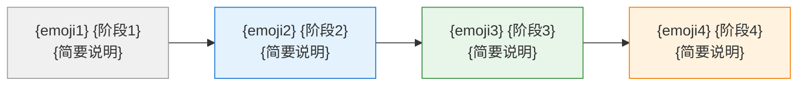

# {场景名称}

{一句话说明当前场景的目标和完成效果，不超过 40 个汉字。例如：引导您完成 ASDM 平台的账户创建和首次登录，获得可正常使用的平台账户并进入组织工作空间。}

## 场景说明

{站在当前用户角色的视角，描述整个场景的操作流程。说明用户从什么状态开始，经过哪些关键操作，最终达成什么效果。}



**旅程概览：**

1. **{阶段1}** — {站在用户视角描述这个阶段做了什么}
2. **{阶段2}** — {站在用户视角描述这个阶段做了什么}
3. **{阶段3}** — {站在用户视角描述这个阶段做了什么}
4. **{阶段4}** — {站在用户视角描述这个阶段做了什么}

**完成本场景后您将获得：**
- ✅ {完成后可获得的具体成果1}
- ✅ {完成后可获得的具体成果2}
- ✅ {完成后可获得的具体成果3}

> {前提条件提示（如有），使用引用块说明}

---

| 章节 | 说明 |
|------|------|
| [1. {操作阶段A}](#1-{操作阶段a锚点}) | {阶段简要说明} |
| [2. {操作阶段B}](#2-{操作阶段b锚点}) | {阶段简要说明} |
| [3. {操作阶段C}](#3-{操作阶段c锚点}) | {阶段简要说明} |
| [N. 下一步](#n-下一步) | 继续探索下一个场景 |

---

## 1. {操作阶段A}

{用 1-2 段话说明本操作阶段的目标和上下文。说明用户在什么情况下需要进行这些操作，以及完成后能达到什么效果。}

### 1.1 {步骤名称}

{说明这个步骤要完成什么目标。}

{详细描述具体的界面操作：在哪个页面、做什么操作、点击什么按钮。引用实际的 UI 文本，使用粗体标注。}

> {注意事项或补充说明（如需要），使用引用块}

{导航路径}


图 1-1：{图例说明}

---

### 1.2 {步骤名称}

{说明这个步骤要完成什么目标。}

{详细描述具体的界面操作。}

{导航路径}


图 1-2：{图例说明}

---

### 1.3 {步骤名称}

{说明这个步骤要完成什么目标。}

{详细描述具体的界面操作。}

{导航路径}


图 1-3：{图例说明}

---

## 2. {操作阶段B}

{用 1-2 段话说明本操作阶段的目标和上下文。}

### 2.1 {步骤名称}

{说明这个步骤要完成什么目标。}

{详细描述具体的界面操作。}

> {注意事项（如需要）}

{导航路径}


图 2-1：{图例说明}

---

### 2.2 {步骤名称}

{说明这个步骤要完成什么目标。}

{详细描述具体的界面操作。}

{导航路径}


图 2-2：{图例说明}

---

## 3. {操作阶段C}

{用 1-2 段话说明本操作阶段的目标和上下文。}

### 3.1 {步骤名称}

{说明这个步骤要完成什么目标。}

{详细描述具体的界面操作。}

{导航路径}


图 3-1：{图例说明}

---

## N. 下一步

{当前场景}完成后，继续完成下一个场景：[{下一场景名称}](../{下一场景路径}/)

---

## 附录：模板使用说明

### A. 文档命名与存放

**文件命名格式**：
```
_index.md                                    # 场景入口文档（必需）
images/{scenario-abbr}-{feature-keyword}.png # 截图文件
```

**存放路径**：
```
asdm-docs/public/docs/zh-cn/content/platform/manual/{scenario-name}/
├── _index.md
└── images/
    ├── {scenario-abbr}-{feature1}.png
    ├── {scenario-abbr}-{feature2}.png
    └── ...
```

### B. 场景说明编写指南

**Mermaid 图要求**：
- 使用 `flowchart LR`（从左到右）展示线性旅程
- 每个节点格式：`["{emoji} {阶段名}<br/>{简要说明}"]`
- 使用 `style` 为不同阶段添加不同背景色
- 建议配色方案：
  - 起始阶段：`fill:#f0f0f0,stroke:#999`（灰色）
  - 核心阶段1：`fill:#e3f2fd,stroke:#1976d2`（蓝色）
  - 核心阶段2：`fill:#e8f5e9,stroke:#388e3c`（绿色）
  - 后续阶段：`fill:#fff3e0,stroke:#f57c00`（橙色）
  - 可选阶段：`fill:#fce4ec,stroke:#c62828`（红色）

**旅程概览编写要求**：
- 使用编号列表
- 每项格式：`**{阶段名}** — {用户视角描述}`
- 描述应说明用户"做了什么"而非"系统做了什么"

### C. 操作步骤编写指南

**步骤名称要求**：
- 简明扼要，动词开头
- 如"进入注册页面"、"填写令牌信息"、"提交创建"
- 避免使用过于技术化的词汇

**步骤说明格式**：
1. 先说明目标：这个步骤要完成什么
2. 再描述操作：在哪个界面、做什么操作
3. 最后提示注意事项（如需要）

**步骤间衔接要求**：
- 每个步骤必须从前一步的结果自然过渡
- 页面跳转必须说明入口（点击什么链接/按钮）
- 不得出现无法从前一步到达的步骤

### D. 截图三要素

每个截图位置必须包含：

| 要素 | 位置 | 格式 |
|------|------|------|
| 导航路径 | 截图上方 | `{层级1} ｜ {层级2} ｜ {层级3}` |
| 截图图片 | 中间 | `` |
| 图例说明 | 截图下方 | `图 {章节号}-{序号}：{说明文字}` |

### E. 与模块功能说明文档的区别

| 维度 | 场景化操作手册 | 模块功能说明文档 |
|------|--------------|-----------------|
| 路径 | `platform/manual/` | `platform/modules/` |
| 模板 | Manual-Doc-Template.md | Module-Doc-Template.md |
| Action | asdm-docs-manual-update | asdm-docs-module-update |
| 组织方式 | 按用户旅程顺序 | 按功能区域分类 |
| 入口 | 场景说明 + Mermaid 图 | 概述 + 功能架构 |
| 末尾 | 下一步（场景导航） | 更多主题（子模块链接） |
